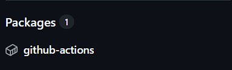
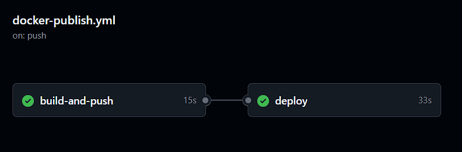
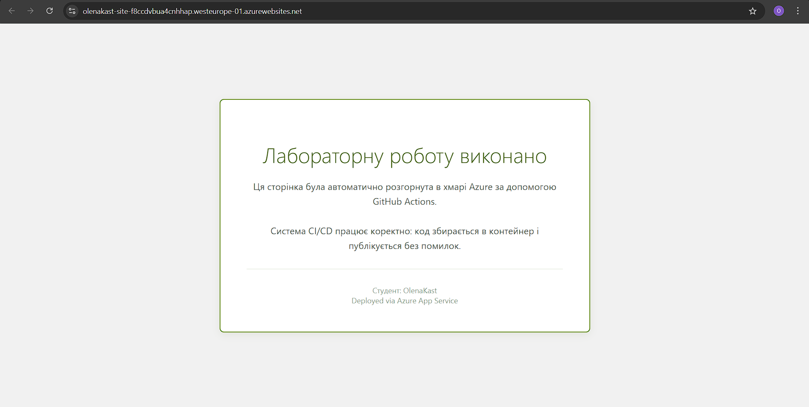

# Практично-лабораторне заняття 8
### Тема: Неперервна інтеграція

### Мета
ознайомитися з принципами і практиками неперервної інтеграції, сформувати навички автоматизації CI/CD процесів в GitHub Actions

## Результат першого завдання:
https://github.com/OlenaKast/skills-hello-github-actions

https://github.com/OlenaKast/skills-publish-packages
## Результат другого завдання: 

### Висновки
Під час виконання лабораторної роботи було розглянуто принципи неперервної інтеграції (CI) та доставки (CD), а також здобуто практичні навички автоматизації процесів за допомогою платформи GitHub Actions. У ході роботи було створено та налаштовано файли конфігурації у форматі YAML, визначено тригери для запуску автоматизації, зокрема ручний запуск (workflow_dispatch) та автоматичний запуск при внесенні змін у код (push).

Окрему увагу було приділено налаштуванню взаємодії між GitHub та Docker, а також інтеграції з реєстром контейнерів GHCR. Це дозволило повністю автоматизувати процес збірки фронтенд-проєкту та створення Docker-образу без необхідності ручного втручання. Результатом роботи став побудований та протестований пайплайн, який забезпечує автоматичну збірку та оновлення Docker-образу при кожній зміні в репозиторії, що демонструє ефективність сучасних підходів до розробки ПЗ.

# Практично-лабораторна робота №9
**Тема:** Неперервна доставка (Continuous Delivery)

### Опис
Метою роботи було ознайомлення з принципами та практиками неперервної доставки (Continuous Delivery), а також формування навичок роботи з хмарними сервісами Microsoft Azure.

Основне завдання полягало в тому, щоб розширити існуючий CI-пайплайн, додавши етап автоматичного розгортання (деплою) веб-додатку в хмару Azure App Service. Це дозволяє автоматизувати процес оновлення сайту одразу після внесення змін у репозиторій, реалізуючи підхід, де код завжди готовий до випуску або розгортається автоматично.

### Результати
1. **Налаштування інфраструктури:**
У хмарі Azure створено ресурсну групу та **App Service** (на базі Linux) для запуску Docker-контейнерів
   
2. **Налаштування безпеки:**
   Згенеровано **Service Principal** для надання GitHub Actions прав доступу до ресурсів Azure.Облікові дані збережено у секретах репозиторію (`AZURE_CREDENTIALS`) 

3. **Автоматизація (Workflow):**
   До файлу конфігурації `.yml` додано job `deploy`, яка виконується після успішної збірки та публікації образу. [cite_start]Використано офіційні екшени `azure/login` та `azure/webapps-deploy` .

   > **Результат виконання в GitHub Actions:**
   >
   > 

4. **Розгортання додатку:**
   Внесено зміни в інтерфейс веб-сторінки та налаштовано коректне кодування UTF-8. Після коміту сайт автоматично оновився у хмарі.

   > **Результат роботи веб-сайту в браузері:**
   >
   > 
   > Посилання на сайт: https://olenakast-site-f8ccdvbua4cnhhap.westeurope-01.azurewebsites.net/
### Висновки
Під час виконання лабораторної роботи я практично освоїла методику неперервної доставки (CD), інтегрувавши хмарну платформу Azure з репозиторієм GitHub. Мною було налагоджено повний цикл автоматизації: від коміту коду та збірки Docker-образу до його автоматичного розгортання на сервері App Service. В процесі роботи я навчилася створювати хмарні ресурси, керувати правами доступу через Service Principal та редагувати YAML-конфігурації для створення залежностей між етапами build та deploy. У результаті було отримано робочий веб-додаток, який оновлюється без ручного втручання, що демонструє ефективність сучасних DevOps-практик для пришвидшення випуску програмного забезпечення.
